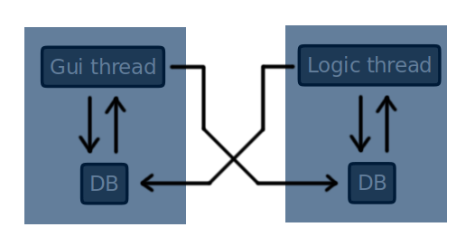

# Multi threaded GTKmm3 example

This is a minimal base for a multi threaded application. It features a special background thread. Communication between threads is based on client-server structure. Simply saying, we send packets between threads.  

Gui thread is equated with Application class, Logic thread with Core class.

## Structure
